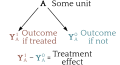
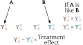
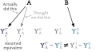
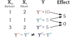
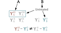
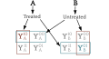

```{r setup, include=FALSE}
knitr::opts_chunk$set(echo=FALSE, 
                      warning = FALSE, 
                      message = FALSE, 
                      dev = "svg", 
                      fig.height = 5, 
                      dev.args=list(bg="transparent"))
library(tidyverse)
library(ggtext)
library(showtext)
library(sf)
library(ragg)

load("./data/WA_tract_2010.RData")
load("./data/lost_letter_tract_122117.RData")
load("./data/seattle_tracts.RData")
load("./data/seattle_all_data.RData")
load("./data/seattle_union.RData")
load("./data/letter_sf.RData")

`%!in%` <- Negate(`%in%`) 
showtext_auto()
exp_colors <- c("#342c5c", "#458490", "#905145", "grey", "#cbd3a3")
y_min <- st_bbox(seattle_union)[2]*0.99
y_max <- st_bbox(seattle_union)[4]*1.01
font_add_google("Quattrocento")
```


class: inverse, cct

# Community Crime Theories

---

# Broken Windows

[Wilson & Kelling (1982)](https://www.theatlantic.com/magazine/archive/1982/03/broken-windows/304465/) describe a system where community disorder (1) increases crime by 
signalling low social control to offenders and (2) decreases actual social control by reducing willingness to use public spaces.
--

.pull-left-60[


]

.pull-right-40[
* A: Disorder signals low guardianship which increases offending.

* B, E: Disorder and crime constrain social relations and impede control.

* C, D: Social control inhibits both disorder and crime.
]

.centernote[
*A theoretical basis for order maintenance policing*
]

---

## Keizer, Lindenberg, & Steg (2008)

Keizer et al. used disorder manipulations and recorded norm violation with field experiments in Groningen, the Netherlands. 

Multiple types of disorder consistently increased in norm violation.
--

.pull-left[


]

.pull-right[
* Powerful causal effect of disorder on multiple forms of norm violation (A).

* High **internal validity** from experimental design.

* Single sites in one city.
]

.centernote[
*Seemingly strong evidence for the direct path*
]

---

# Collective Efficacy

[Sampson & Raudenbush (1999)](https://doi.org/10.1086/210356) contend that disorder and crime are both manifestations of low collective efficacy—the community's capacity for informal social control.
--

.pull-left-60[

]

.pull-right-40[
* A: Disorder has no direct impact on crime.

* C, D: Disorder and crime are products of low collective efficacy—social control—which is exogenous (B, E).
]

.centernote[
*A, B, and E represent testable constraints on Broken Windows.*
]

---

## Sampson & Raudenbush (1999)

Simultaneous equations of crime, disorder, and collective efficacy in Chicago neighborhoods, using survey-measured collective efficacy and objectives measure of disorder: Video of block faces coded by researchers.

--

.pull-left[


.small[<sup>*</sup> Effect found only for robbery.]

]


.pull-right[
* Effect of neighborhood disorder on crime (A) absent conditional on collective efficacy (B,D)

* Control for crime impact on collective efficacy (E), but assume no disorder feedback on collective efficacy (absent B).

* High **external validity**: *Real* disorder and crime.
]

.centernote[
*Evidence against broken windows in real settings, but vulnerable to spuriousness*
]

---

# Today's Talk


Addressing questions raised by these (and related) studies

Bringing methodological concerns to the forefront

Show some key experimental results

Take a glimpse of related work

Chart a path forward for communities research

---
class: inverse

# Causality and Counterfactuals

.image-75[

]

---

# Potential Outcomes

Causal effects are differences between *counterfactuals* or *potential outcomes*

.image-75[

]

--

Fundamental problem: We only ever see *one* outcome

--

.centernote[
*With some assumptions, we can estimate the treatment effect*
]

---

# Ignorability

We can compare different units if their differences are *ignorable*

.image-75[

]

---
count: false

# Ignorability

We can compare different units if their differences are *ignorable*

.image-75[

]

--

We do this with *randomization* or *conditioning on variables*

* Most prefer randomization because communities are **complex**

--

.centernote[*But ignorability is not the only assumption*]

---

# SUTVA<sup>1</sup>

.pull-left[
.image-87[

]
]

.pull-right[
### Consistency

* Only one treatment at each measured level
   * No *versions* of treatment
   * No *compound treatments*
* Assignment mechanism for treatment doesn't affect outcomes
]

.footnote[[1] Stable Unit Value Treatment Assumption]

---

# SUTVA<sup>1</sup>

.pull-left[
.image-87[

]
]

.pull-right[
### Consistency

* Only one treatment at each measured level
   * No *versions* of treatment
   * No *compound treatments*
* Assignment mechanism for treatment doesn't affect outcomes

### No interference

* Unit outcomes are not affected by the treatment assignment of other units
]

.footnote[[1] Stable Unit Value Treatment Assumption]

---

# Consistency

A mismeasurement: Different types of treatment treated as the same

.image-75[

]

Commonly violated in field experiments *and* observational research

* e.g., scales combining different treatments<sup>1</sup>

.footnote[[1] see [VanderWeele (2022)](https://doi.org/10.1097/EDE.0000000000001434)]

---

## Consistency: Asymmetry

Occurs when treating and removing treatment has different effects

.image-75[

]

--

Nearly all studies assume symmetry—but reality is often asymmetric<sup>1</sup>

* *Pulling the knife out doesn't heal the wound*
* Control conditions may *alter existing states*

.footnote[[1] See Lieberson (1985) *Making it Count*]

---

# Interference

Interference means some units' treatments influence other units' outcomes

.image-75[

]

--

These spillovers are common in the real world: What happens nearby matters

---

# Interference

Interference gets complicated quickly

.image-75[

]

--

Can often be ruled out in experiments

* But real processes have spillovers
* Large-scale shocks or policies have unanticipated effects<sup>1</sup>

.footnote[[1] See [Nagin & Sampson (2019)](https://www.annualreviews.org/doi/abs/10.1146/annurev-criminol-011518-024838)]

---
class: inverse, sncp

# The Seattle Neighborhoods and Crime Project


---

## The Experiments

A series of large-scale field experiments embedded in Seattle neighborhoods with rich ecological survey data

* Balance the strengths and weaknesses of experimental and observational methods

--

&zwj;1. **Mailbox Experiment**

* Effect of disorder on crime / prosocial behavior (replicate Keizer)
* Association between collective efficacy and crime / prosocial behavior

--

&zwj;2. Lost Letter

&zwj;3. Littering Intervention

&zwj;4. Litter Clean-Up


---

<br>
<br>


---

# Number of Trials

```{r, eval=TRUE,  echo=FALSE, message=FALSE, cache=TRUE, warning=FALSE, dev='svg', fig.height = 5}
exp_df <- expand.grid(year = 2014:2017,
                      experiment = c("Lost Letter", "Mailbox", "Litter\nIntervention", "Litter\nClean-Up")) %>%
  mutate(active = case_when(
    experiment=="Mailbox" & year==2014 ~ 1,
    experiment=="Mailbox" & year==2015 ~ 1,    
    experiment=="Mailbox" & year==2016 ~ 1,
    experiment=="Mailbox" & year==2017 ~ 1,
    experiment=="Lost Letter" & year==2015 ~ 2,
    experiment=="Lost Letter" & year==2016 ~ 1,
    experiment=="Litter\nIntervention" & year==2017 ~ 1,
    experiment=="Litter\nClean-Up" & year==2016 ~ 2,
    experiment=="Litter\nClean-Up" & year==2017 ~ 1,
    TRUE ~ 0
  ), trials = case_when(
    experiment=="Mailbox" & year==2014 ~ 132,
    experiment=="Mailbox" & year==2015 ~ 41,    
    experiment=="Mailbox" & year==2016 ~ 104,
    experiment=="Mailbox" & year==2017 ~ 128,
    experiment=="Lost Letter" & year==2015 ~ 432,
    experiment=="Lost Letter" & year==2016 ~ 2938,
    experiment=="Litter\nIntervention" & year==2017 ~ 576,
    experiment=="Litter\nClean-Up" & year==2016 ~ 6,
    experiment=="Litter\nClean-Up" & year==2017 ~ 21,
    TRUE ~ as.numeric(NA)
)) %>%
  mutate(experiment = forcats::fct_relevel(experiment, "Litter\nClean-Up", "Litter\nIntervention", "Mailbox", "Lost Letter"))

exp_colors <- c("#342c5c",  "#905145", "#458490", "#cbd3a3")

experiment_timeline <- ggplot(exp_df, aes(x=factor(year), y=experiment, fill=factor(active))) + 
  xlab(NULL) + ylab(NULL) + ggtitle(NULL) + 
  geom_tile(color="white", width =1 , height = 1) + 
  geom_text(size=8, color="#cbd3a3", hjust=0.5, aes(label=trials), family = "Quattrocento") +
  scale_fill_manual("Trial Type", values=c("2" = "#458490", "1" = "#342c5c", "0" = "white"),
                    labels = c("2" = "Pilot", "1" = "Standard", "0" = "")) +
  coord_fixed(ratio = 1, expand=FALSE) +
  scale_y_discrete(labels = ) +
  theme(
        text = element_text(family = "Quattrocento", size = 20, debug = FALSE),
        legend.position = "right",
        axis.text.y = element_text(hjust = 0.5, color = exp_colors, face = "bold"),
        panel.grid = element_blank(),
        axis.ticks = element_blank(),
        panel.background = element_blank(),
        plot.margin = margin(0, 0, 0, 0)
    )
experiment_timeline
# ggsave(file = "./img/experiment_timeline.svg")
```

---

```{r, eval=TRUE, echo=FALSE, warning=FALSE, message=FALSE, cache=TRUE, results='hide', dev="svg", fig.height=6.15}
letter_tracts <- c("00100", "01000", "10100", "10200", "10300", "10500", "10600", 
                   "10800", "10900", "01100", "11101", "11102", "11200", "11300", 
                   "11500", "11600", "11700", "11800", "11900", "01200", "12000", 
                   "12100", "01300", "01400", "01500", "01600", "01800", "01900", 
                   "00200", "02000", "02100", "02200", "02400", "02500", "02600", 
                   "02700", "02800", "02900", "00300", "03000", "03100", "03200", 
                   "03300", "03400", "03500", "03600", "03800", "03900", "04000", 
                   "00401", "00402", "04100", "04200", "04400", "04500", "04600", 
                   "04700", "04800", "04900", "00500", "05000", "05100", "05200", 
                   "05301", "05400", "05600", "05700", "05801", "05802", "05900", 
                   "00600", "06000", "06100", "06200", "06300", "06400", "06500", 
                   "06600", "06700", "06800", "06900", "00700", "07000", "07100", 
                   "07200", "07300", "07500", "07600", "07700", "07800", "07900", 
                   "00800", "08001", "08002", "08100", "08200", "08300", "08400", 
                   "08500", "08600", "08700", "08800", "08900", "00900", "09000", 
                   "09100", "09200", "09400", "09500", "09600", "09701", "09702", 
                   "09800", "09900", "10001", "10401", "10701", "11001", "11401", 
                   "01701", "04301", "07401", "10002", "10402", "10702", "11002", 
                   "11402", "01702", "04302", "07402")

mailbox_tracts <- c("02700", "08900", "09200", "06800", "07500", "09100", "02800", 
                   "00100", "10002", "10300", "10402", "10600", "02600", "05600", 
                   "06100", "06300", "07402", "07800", "09000", "09701")
  
littering_tracts <- c("00100", "01701", "02600", "04700", "06800", "07100", "07500", 
                      "08900", "09100", "09701", "10402", "11402")
KC_tract_2010 <- maptools::elide(WA_tract_2010[WA_tract_2010@data$COUNTYFP10=="033",], rotate=-16)
map_tracts <- st_as_sf(KC_tract_2010[as.numeric(str_sub(KC_tract_2010@data$GISJOIN, -5,-1)) %in% 100:12100, "GISJOIN"]) %>%
  mutate(tract = str_sub(GISJOIN, -5,-1))
experiment_tracts <-  map_tracts %>%
  mutate(mailbox = tract %in% mailbox_tracts,
         littering = tract %in% littering_tracts,
         lost_letter = tract %in% letter_tracts) %>%
  mutate(Experiment = case_when(
    mailbox==TRUE & littering==TRUE ~ "Mailbox, Litter Intervention",
    mailbox==TRUE ~ "Mailbox",
    littering==TRUE ~ "Litter Intervention",
    lost_letter==FALSE ~ "No Letters",
    TRUE ~ "Only Letters"
  )) %>%
  mutate(Experiment = fct_relevel(Experiment, "Mailbox, Litter Intervention", "Mailbox", "Litter Intervention", "Only Letters", "No Letters"))

trial_map <- ggplot(experiment_tracts, aes(fill=Experiment)) + 
  geom_sf(size=0.1, aes(color=Experiment)) + 
  coord_sf(datum=NA, expand=FALSE) +
  scale_fill_manual("Experiments\nConducted", 
                    values = c("Mailbox, Litter Intervention"="#342c5c", "Mailbox"="#458490", "Litter Intervention"="#905145", "Only Letters"="#cbd3a3", "No Letters"="grey")) +
  scale_color_manual("Experiments\nConducted", 
                     values = c("Mailbox, Litter Intervention"="white", "Mailbox"="white", "Litter Intervention"="white", "Only Letters"="white", "No Letters"="white")) +
  theme_minimal(base_size = 20, base_family = "Quattrocento") +
  theme(plot.margin = margin(0, 0, 0, 0))
trial_map
```

---

class: inverse
# The Mailbox Experiment

---

# Mailbox: Method

.pull-left[
.image-75[

]
]


* A letter containing a visible $5 bill is left near mailbox for passersby to encounter.

---

count: false
# Mailbox: Method

.pull-left[
.image-75[

]
]


* A letter containing a visible $5 bill is left near mailbox for passersby to encounter.

* Litter and a sign board with graffiti are introduced to manipulate disorder.

--

* Researchers record whether participants mail, steal, or ignore the envelope.<sup>1</sup>

.footnote[[1] Perceived gender, age, and group size of participants were also recorded to adjust for compositional differences between conditions]

--

* Recorded if disorder was present *prior to trial*

--

* We conducted 368 trials with 3,481 participants in 20 Seattle census tracts.


---

# Mailbox: Model

Objective: Causal test of direct effect of disorder on crime (A).

<br>
<br>

.image-63[

]


---

# Mailbox: Model

Our Experiment: Causal tests of direct effects of disorder on crime and prosocial behavior—and associations with collective efficacy
<br>

.image-75[

]


---

# Mailbox: Results

```{r, eval = FALSE}
tribble(~Condition, ~`Walk-By`, ~Mail, ~Theft,
        "Control", 1496, 176, 28,
        "Treatment", 1617, 136, 28
       ) |>
  pivot_longer(`Walk-By`:Theft, names_to = "Outcome", values_to = "Count") |>
  group_by(Condition) |>
  mutate(Prop = Count / sum(Count)) |>
  ggplot(aes(group = Condition, y = Prop, x = Outcome, fill = Condition)) +
  geom_col(position = "dodge") +
  geom_text(aes(label = paste0(Prop*100, "%"), y = Prop + 0.05), position = position_dodge(width = 1))
```


<table style="width:70%">
  <tr>
    <td style="font-size:115%" colspan="5">Mailbox: Participant Actions</td>
  </tr>
  <tr>
    <th>Condition</th>
    <th>Walk-By</th>
    <th>Mail</th>
    <th>Theft</th>
  </tr>
  <tr>
    <td rowspan="2">Control</td>
    <td>1496</td>
    <td>176</td>
    <td>28</td>
  </tr>
  <tr>
    <td>88.0%</td>
    <td><strong>10.4%</strong></td>
    <td><strong>1.6%</strong></td>
  </tr>
  <tr>
    <td rowspan="2">Treatment</td>
    <td>1617</td>
    <td>136</td>
    <td>28</td>
  </tr>
  <tr>
    <td>90.8%</td>
    <td><strong>7.6%</strong></td>
    <td><strong>1.6%</strong></td>
  </tr>
</table>

Key Findings:

* Disorder has **no impact on theft**—Keizer et al. (2008) fails replication<sup>1</sup>

.footnote[[1] No significant positive relationship in *any* of the 20 locations]
--

* Disorder **reduces mailing**

--

* Thefts higher where **prior disorder** is present, but no difference in treatment effect

--

* Collective efficacy predicts less **theft** and **prior disorder**


---

TRANSITION

---
class: inverse

# Recent Projects

* [Lanfear (2022) "Collective efficacy and the built environment" *Criminology*](https://github.com/clanfear/ccl_cv/raw/master/articles/Collective%20Efficacy%20and%20the%20Built%20Environment.pdf)

   * Urban political economy, social control, and situational opportunity
   * Modeling long-term, large-scale, endogenous processes

--

* Lanfear & Matsueda (Ongoing) "A micro theory of crime opportunities:
Symbolic interaction among motivated offenders, suitable targets, and capable
guardians"

   * A micro-foundation for situational opportunity and informal control theories

--

* Lanfear (Ongoing) "Collective efficacy and formal social control"

   * The relationship between norms of intervention and police effectiveness

---

# Moving Forward

## Survey Research

Strengths of survey but weaknesses: endogeneity; answer with experiments, but  some things difficult to manipulate and external validity an issue; some things not identifiable but not manipulable either---CE -> built environment
    Pitch a 3rd community survey wave in Chicago
    Pitch CE interventions

## Embedded Experiments

## New Data Sources

* Human mobility data

* Space-time budgets

## Multilevel Theory
